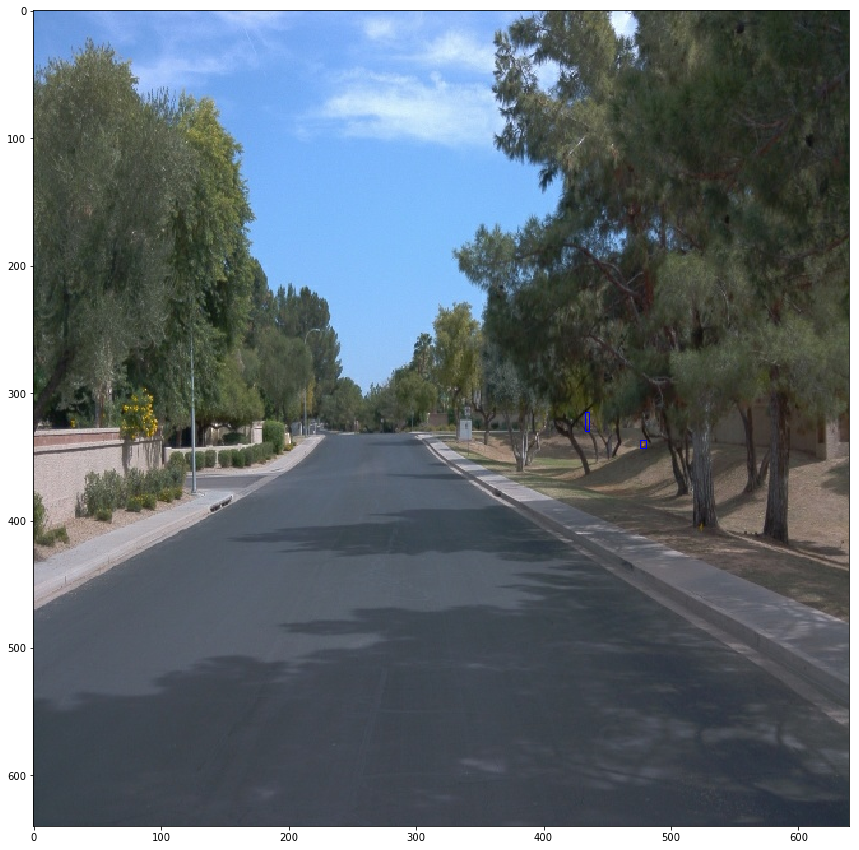
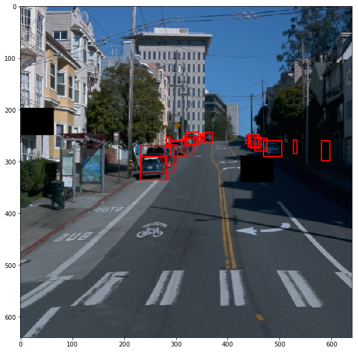
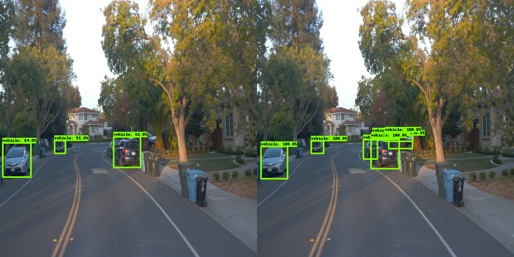
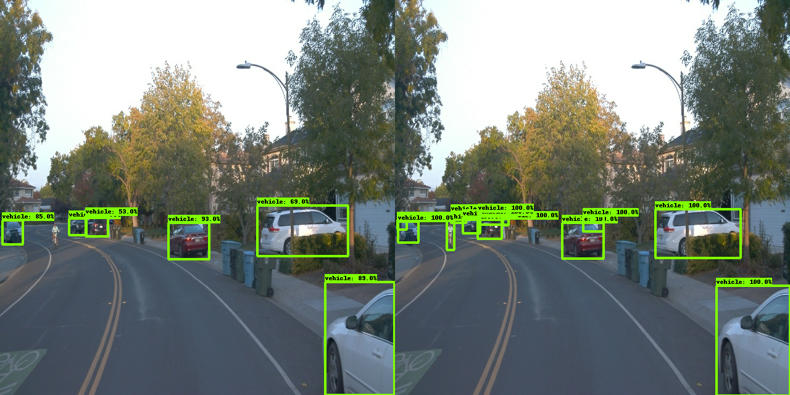

# Project overview 
### Object Detection in Urban Environment
This project is focused on utilizing machine learning to identify objects in the environment. It is crucial part of every autonomous system, as the vehicle needs to be aware of its surrounding and act according to it. One of the examples can be path planning, which should utilize detected objects class and localization to find the best way around.

# Set up
Jupyter notebooks and Python scripts were run on the local machine, using provided Dockerfile. Data was downloaded from Udacity's workspace, to avoid processing on local machine. \
Training and evaluating the model was done on Udacity's VM, due to lack of appropriate GPU. \

To clone the repository use: 
```
git clone https://github.com/nikodemj9/nd013-c1-vision-starter.git
```

To split the dataset into train/validation/test run:
```
python ./create_splits.py --source ./data/waymo/training_and_validation/ --destination ./data/waymo
```

To edit configuration and move to reference catalog:
```
python edit_config.py --train_dir /home/workspace/data/waymo/train/ --eval_dir /home/workspace/data/waymo/val/ --batch_size 8 --checkpoint /home/workspace/experiments/pretrained_models/ssd_resnet50_v1_fpn_640x640_coco17_tpu-8/checkpoint/ckpt-0 --label_map label_map.pbtxt
mv pipeline_new.config experiments/reference/
```

Running training and evaluation:
```
python experiments/model_main_tf2.py --model_dir=experiments/reference/ --pipeline_config_path=experiments/reference/pipeline_new.config

python experiments/model_main_tf2.py --model_dir=experiments/reference/ --pipeline_config_path=experiments/reference/pipeline_new.config --checkpoint_dir=experiments/reference/
```

Monitoring the process with Tensorboard:
```
python -m tensorboard.main --logdir /app/project/experiments/reference/
```

## Dataset
### Dataset analysis

Dataset contains images with annotated cars, pedestrian and cyclists. 

Observations regarding the dataset:
* vast majority of annotated objects in dataset are cars, 
* cyclists are very rare in dataset, which may influence the final model performance,
* objects are often occluded (for example cars parked along the street, pedestrians crossing the road),
* contain bad weather conditions, with sensor partially occluded,
* contain night drive, however high brigtness scenarions are not so often.

Examples of the images:




Statistics over 10 000 images:
* total objects: 235 541,
* car class [min, max, mean, percent of all objects]: [0, 66, 18,0302, 76.55%]
* pedestrian class [min, max, mean, percent of all objects]: [0, 44, 5.383, 22.85%]
* cyclists class [min, max, mean, percent of all objects]: [0, 6, 0.1409, 0.60%]

As we can see from this statistic, there are images with zero classes of particular type. Moreover, cyclists are very small percentage of all objects.

### Class histograms

Car class is pretty well distributed in range between 0 and 38. Less than 350 images have 0 cars.


More than 4000 images don't contain pedestrian. The rest of them usually have up to 5 pedestrians. 


Vast majority of images don't cointain cyclists (over 8000). The rest usually have 1 cyclist visible. More than 1 cyclist occurs very rarely.

### Brightness histogram
Looking at the examples of the images in the dataset we can see that it contains both night and day driving. However it seems that we are lacking the images with high brightness (when car is driving towards the sun). To check if it's true the brightness histogram over 200 random images was created.


#### Cross validation
The dataset was split to train / validation / test subsets in 70% / 15% / 15% proportions.
In general the training set should be between 60-80% of whole dataset. Since our dataset isn't particularly large, I've decided to give more than minimum value for training. 

### Training
#### Reference experiment
Reference training was done using original configuration file, batch size was set to 8. Smaller batch sizes resulted in very high loss.
Configuration is using following augmentations: random_horizontal_flip, random_crop_image.

Metrics from TensorBoard:


Training is proceeding as expected, both precision and recall increases over next steps.
Loss is also descreasing for each step, both for training and evaluation steps. Further training of the neural network should lead to better results. \
There isn't also any sign of data overfitting (like e.q. training loss descreasing, while evaluation loss increases).


Model was able to recognize 3 non-obstructed cars. Vehicles in the far distance weren't recognized. The same goes for the vehicles on the right, which have less contrast color in regard to the background.

Similar situation as in above example. Vehicles in the back were recognized as one single vehicle. Vehicles on the right are still not classified.

Similar situation as in above example.

Similar situation as in previous examples.

Vehicles in the back are recognized as 2 vehicles (instead of 3). Car on the left, cyclist and obstructed car on the right are not recognized.

Vehicles in the back are not recognized in this picture at all.

Vehicles in the back are again recognized as 2 vehicles. Model is able to detect obstructed vehicle on the right (behind red vehicle).

Obstructed vehicles on the right are not detected.

Only one, highly-obstructed, car wasn't recognized in this image.

Trash can was classified as vehicle (false-positive). Some obstructed cars weren't recognized.

Looking at the above examples we can see that the model mostly struggles to detect obstructed vehicles, especially if they have similar color as background. Adding random black squares on the image, as well as adjusting contrast might help with that.


## Improve on the reference #1
Image augmentation added:
* random adjust brigthness 
    * max_delta: 0.1
* random adjust contrast 
    * min_delta: 0.9
    * max_delta: 1.1)
* random black patches 
    * max_black_patches: 3
    * probability: 0.5
    * size_to_image_ratio: 0.1


These augmentations should help to detect cars with color similar to the background (brighness, contrast), as well as occluded vehicles (random black patches).





## Experiment with augmentations #1

In fact, adding these augmentations lead to worse results than in reference model. They might lead to better results, if the model was trained on more epochs.
Both precision and recall values are lower than in reference model.

Metrics from TensorBoard:





As we can see from the images, model is only able to recognize vehicles which are relatively close to the camera and not occluded. Only improvement over reference model is that we no longer have false positive on the trash bin.


## Improve on the reference #2
Image augmentation added:
* random adjust brigthness 
    * max_delta: 0.2
* random adjust contrast 
    * min_delta: 0.8
    * max_delta: 1.2)
* random rgb to gray
    * probability: 0.5

Due to unsatisfactory results of previous experiment, I've decided to exchange random black patch with random rgb to gray augmentation, hoping that it will improve features detection.


## Experiment with augmentations #2

Second experiment have slightly worse results than the previous one.

Metrics from TensorBoard:


As we can see from the images, model is behaving worse than in previous case. For last image it wasn't able to detect any vehicles at all.

## Improve on the reference #3
In regards to the previous experiment, the optimizer was changed to ADAM optimizer with reduced learning_rate_base and warmup_learning_rate.

adam_optimizer:
* learning_rate
    * cosine_decay_learning_rate
        * learning_rate_base: 0.01
        * total_steps: 2500
        * warmup_learning_rate: 0.00333
        * warmup_steps: 200
    * epsilon: 1e-8

## Experiment with augmentations #3


## Improve on the reference #4
In regards to the previous experiment:
* batch_size was reduced to 2, mainly to reduce training time (which was about 2 hours for previous exercises)
* learning rate was further reduced, still using ADAM optimizer

adam_optimizer:
* learning_rate
    * cosine_decay_learning_rate
        * learning_rate_base: 0.0001
        * total_steps: 2500
        * warmup_learning_rate: 0.0000333
        * warmup_steps: 200
    * epsilon: 1e-8

## Experiment with augmentations #4


Finally, we can see improvement over the reference model, both for precision and recall. We can see that total loss value is noisy, which may be reduced by further tuning the learning rate values. Most likely adding more augmentations and increasing training time could lead to improving overall result, as we don't see overfitting yet.


Additional vehicle (occluded one) is detected in regard to reference model.


Vehicles on the right side weren't detected (in regard to reference)


Similar performance with slightly higher confidence for most vehicles.


The vehicles on second plan werent detected


Similar performance, vehicles on the second plan were detected as one.


Vehicles on second plan were detected as two separate objects, rest of the detections have higher confidence.


Similar perfomance. Garage detected as vehicle (false positive, low confidence).


Additional vehicle on the right classified.


Trash can recognized as a vehicle (false positive, low confidence).


Vehicle in the back recognized as two separate vehicles (car is occluded by the tree).

## Animation
